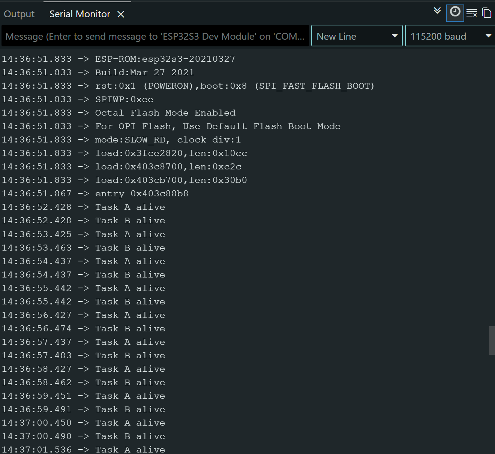

# ESP LAB 2:

Collaboration between Jihu Nam and Jan-Patrick Glaeser: 

## Hardware and software

    Board: ESP32-S3-WROOM-2
    Arduiono IDE board selection: ESP 32S3 Dev Module
    Software: Arduino IDE ESP32 Espressif System
    RGB-Pin: GPIO 38
    Baudrate: 115200 Baud

## Prediction and observation table

### Scenario A: 

#### Prio: 
    Task A 1 , Task B 1
#### Prediction before test:
	Task A will run because both have the same priority and task B will wait for the end of Task A to finish.
#### Actual observation:
	First task A, after this task B and this in a loop. When we changed the order of xTaskCreatePinnedToCore, always the Task which comes first in the code is the first one to execute. We suspect that it is because it is the task which is created first.
#### Did it match? Why?:
     yes it matched what we've expected. But with the difference that the Task isn't finishing. With the command vtaskDelay it's put in the blocked state. That allows the Task B to execute now. We learned in the lecture that this is slicing. When multiple Tasks with the same priority share their CPU time. 

### Scenario B:
#### Prio: 
    Task A 2 , Task B 1
#### Prediction before test:
	Task A will run first because it has the higher priority and task B is only running as Task A is blocked. When its blocked task B is allowed to run.
#### Actual observation:
	First task A, after this task B and this in a loop. We even changed the order from xTaskCreatePinnedToCore. Task A is always the first because of its priority.
#### Did it match? Why?:
	Yes it matched as we expected because Task A has the higher priority. When on the same core both of the Tasks are ready, Task A is running because of it's higher priority. 

### Scenario C:
#### Prio: 
    Task A 1 , Task B 2
#### Prediction before test:
	First Task B will run because it has the higher priority and task A will wait for the end of Task B
#### Actual observation:
	First task B, after this task A and this in a loop. We also changed here the order of xTaskCreatePinnedToCore. But task B is always the first because of its priority.
#### Did it match? Why?:
	Our prediction matched what we observed. Only with the difference that here Task A is also not waiting for task B to finish. When task B get's in the blokced state because of the vtaskDelay, it's allowing the Task A with the lower priority to run.

## 5.Temporary starvation experiment
    We added to our code a serialprint in Task B. We did it so we could better observe what happend. Therefor we could see during the starvation experiment that we only had an output from the Task A. There was no output from Task B. We expected as much because we thought that task A is always ready and never get's blocked and has the higher priority that task B can never run on the same core.

## 6.Explain using RTOS task states
    In our programm a task is running when it is executing a instruction on a Core of a CPU. In our exercise we use only one of the two cores of the ESP 32. That means only one of our two task can run at a time. When task A is running it prints "Task A alive" and when task B is running it prints "Task B alive" and switches the RGB LED on the board on and off. Each turn is 0.5s long. The scheduler decides which task is allowed to run and when. It decides with the priorities given from us. 
    We use the vTaskDelay to get a Task in the blocked state for a certain time. During this time the CPU can execute the other task. When the time of the delay expires the Task get's in the ready state again. When the task is ready again it depends on the scheduler and the periorities if and when it's going to be executed again. 
    The scheduler selects the task with the highest ready priority on this specific core. In Scenario A, our both task had the priority 1. We observed that task A was followed by task B and that repeatedly. They can share CPU time. thats called time slicing. 
    We could see in our Scenario B that Task A had a higher priority. We observed that task A was followed by Task B. In Scenario C it was the oposide and there we observed that task B was followed by task A. In Both cases also the task woth the lower priority could execute because the higher priority task was put in vTaskDelay.
    We only observed during the starvation test an output from Task A. It's preventing the lower Task from running because Task A is running all the time and doesn't get put in the blocked state.

## Final configeration: 

 Task A: 2
 Task B: 1
 both Core 1
 all Delays restored

## Image 
