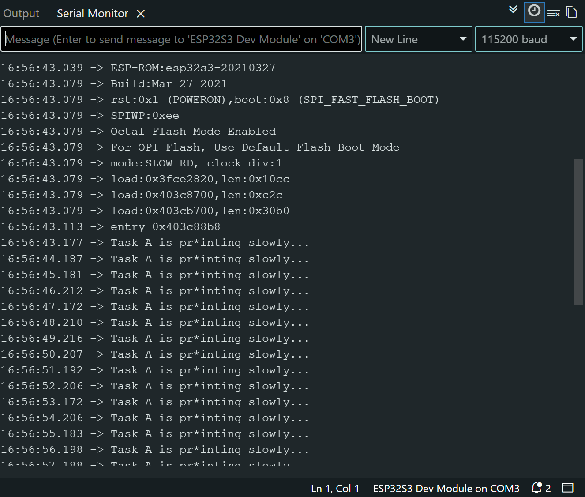

# ESP LAB 3:

## Purpose
    The purpose of this Lab exercise is to investigate how scheduler handles task states und to observe how priorities change how the scheduler is selecting.

## Hardware and software

    Board: ESP32-S3-WROOM-2
    Arduino IDE board selection: ESP 32S3 Dev Module
    Software: Arduino Espressif ESP32 
    Baudrate: 115200 Baud

## My three test scenarios: Prediction and observation table
### Scenario A 
    Task A = 1, Task B = 2
#### Prediction 
    My expectation is that Task A will start printing first because Task B is blocked, waiting for notification. In the moment task a sends the notification, task B gets in the state ready. At this moment because task B has the higher priority task A will be preempted and task B will execute. Task B will print "*" before task A continues and will finish. 
#### Observation
    Task A starts first with printing the message. After the 12 letter it sends the notification to Task B. Task B becomes ready and because of it's higher priority its printing "*" at this moment. After that Task A continues printing it's message. 
    It matched my prediction. Task B has the higher priority and because of that, when its getting in the ready state, Task A gets preempted so that Task B with the higher priority can run immediately. When Task B has printed "*" it gets blocked again and Task A can continue printing the whole message.

### Scenario B
    Task A = 1, Task B = 1
#### Prediction 
    My expectation is that Task A will start printing first because Task B is blocked, waiting for notification. In the moment task A sends the notification, task B gets in the state ready. But my expectation is that nothing will change and task A will continue and finish the Task because the priorities are the same there is no need for the scheduler to intervene. I expect that after Task A has finished, Task B will execute and print "*".
#### Observation
    Task A did finish printing it's whole message before Task B printed "*". Additional could I observe that the "*" is at the beginning from the next line because I didn't use println. I just used print.
    It matched my prediction. Because both Tasks have the same priority. I could observe that Task B didn't preempt Task A. After Task A became blocked with the vTaskDelay command, Task B could run.

### Scenario C
    Task A = 1, Task B = 3
#### Prediction 
     I expect that it will happen the same as in Scenario A. So my expectation is that Task A will start printing first because Task B is blocked, waiting for notification. In the moment task a sends the notification, task B gets in the state ready. At this moment because task B has the higher priority task A will be preempted and task B will execute. Task B will print "*" before task A continues and will finish.
#### Observation
    Task A starts first with printing the message. After the 12 letter it sends the notification to Task B. Task B becomes ready and because of it's higher priority its printing "*" at this moment. After that Task A continues printing it's message. 
    It matched my prediction. Task B has the higher priority and because of that, when its getting in the ready state, Task A gets preempted so that Task B with the higher priority can run immediately. When Task B has printed "*" it gets blocked again and Task A can continue printing the whole message.

## Scheduler Behavior
    The scheduler decides which Task that is in the ready state is allowed to use the CPU Core. Which is allowed to execute their commands. When a Task is executing on the CPU its in the running state. A Task that is already in the ready state is waiting to be picked by the scheduler.  A Task that is blocked is waiting for a time or an event to get in the ready state. A blocked Task can't be selected by the scheduler.
    Task B is in our exercise initially blocked because it is waiting in ulTaskNotifyTake for the notification from Task A. When Task A printed 12 characters it calls xTaskNotifyGive and because of that task B changes the state from Blocked to Ready.
    Task B has in our Scenario A the priority 2 and Task A has 1. Because of that when it becomes the notification, Task B preempts Task A and prints "*". After that Task A continues to print the whole message. After Task B already prints its character it is waiting for the next notification. Therefore it is in the Blocked state again. 
    Scenario B: In this case both tasks have the priority 1. I could see in this scenario that Task A finishes it's first message before Task B printed "*". This is because Task B had no advantage because of the priority. Therefore the "*" gets printed before the print of Task A in the next line. 
    
 ## Serial Monitor Output

