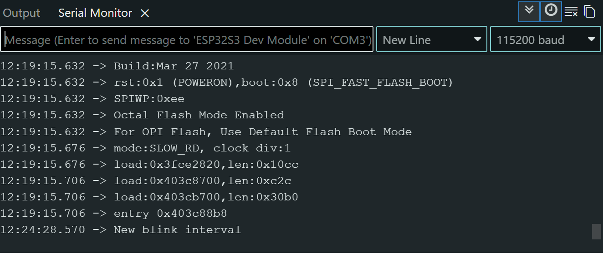
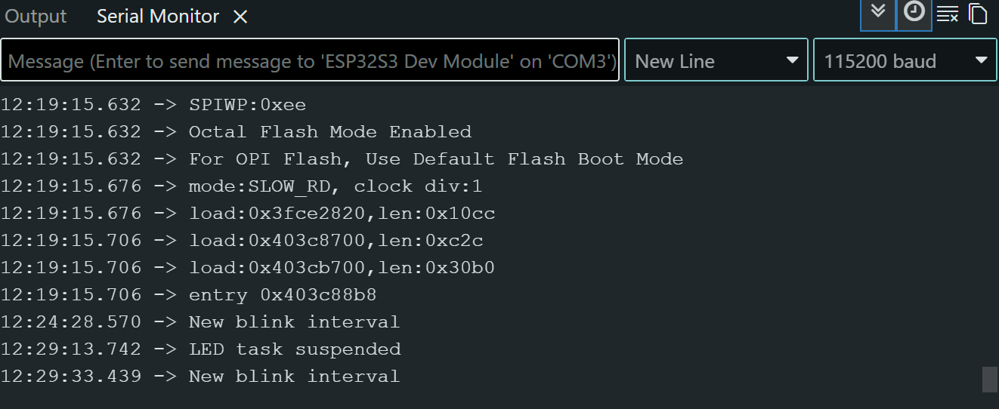
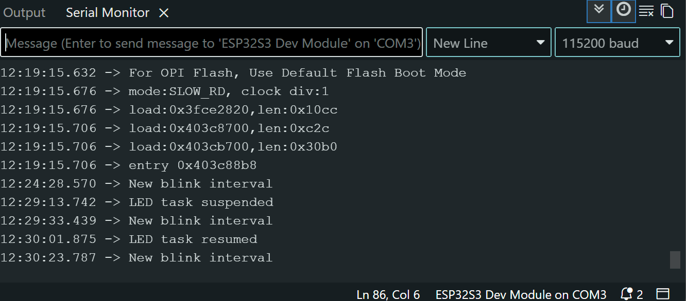

# ESP LAB 3:

## Hardware and software

    Board: ESP32-S3-WROOM-2
    Arduino IDE board selection: ESP 32S3 Dev Module
    Software: Arduino Espressif ESP32 
    RGB LED: GPIO 38
    Baudrate: 115200 Baud

## Task Design

### Serial Task
    reads commands from the serial monitor that I write
    only accepts values (250, 500, 1000) and commands (suspend, resume) (to control the RGB task)

### RGB LED Task
    controls the already installed RGB LED
    The value of blinkInterval is the current ON and OFF time

### priorities
    Both tasks have the same priority (1)

### core assignment
    Both Tasks are using the same Core.

## Task Handles

There are two handles created:
    TaskHandle_t serialTaskHandle = NULL;
    TaskHandle_t ledTaskHandle = NULL;

The LED task handle is used to suspend and resume the LED Task:
    vTaskSuspend(ledTaskHandle);
    vTaskResume(ledTaskHandle);

## Prediction

### Situation

#### LED task running normally 	 
    The LED blinks normally with the blink interval and the serial Task accepts normally commands.

#### LED task suspended
    The LED Task stops to blink at all. but the other Task will normally continue to work and will accept commands.

#### LED task resumed
    Everything works normal again. The LED starts blinking again.

## Suspend / Resume Test

    The LED stopped blinking when I entered suspend but the serial Task was still working correctly. I also still could enter a new value for the blink interval while the LED task was suspended.
    When I entered the command resume, the LED started blinking again like it is supposed to do. It also used the new blink interval.
    I also noticed that even when the LED stays ON or OFF when the task is suspended. It depends on the state it is at this exact moment.

### Screenshot 1 - Running

### Screenshot 2 - Suspended

### Screenshot 3 - Resumed

## State Analysis

### Situation 1 – Normal operation

Serial Task: Blocked / Running

RGB LED Task: Blocked / Running

Both of the Tasks are changing repeatedly between the Running and Blocked states. The Serial Task gets blocked because of the vTaskDelay. And the blink delay is blocking the LED Task. Which Task is getting selected by the scheduler becomes Running.

### Situation 2 – LED task is suspended

Serial Task: Running

RGB LED Task: Suspended

In this situation the Serial Task is running because it's processing the command. The RGB Task suspended and the scheduler can't select it. But the Serial Task continues to accept commands. 

### Situation 3 – LED task is resumed

Serial Task: Running

RGB LED Task: Ready

The vTaskResume changes the LED from suspended to ready. Ready doesn't means running. 

## Reflection 
We use a TaskHandle to identify and control the Tasks that are on the same Core of our ESP 32. In this scenario the Serial Task reads the commands from the serial monitor that I can give it. It's than changes the shared variable. The LED task than uses the shared variable to control how fast the RGB blinks.
When the LED task was suspended, the serial Task has continued to work. I could still enter a new value to change it's value. This value was than updated and shared. After I entered resume, the vTaskResume(ledTaskHandle) made the LED task in the ready state again. The scheduler could run it again. However the LED continued blinking with the new interval after that. 
During the normal situation both of the tasks also entered the blocked state because of vTaskDelay. It showed me that tasks can work independent and can even share some variables.